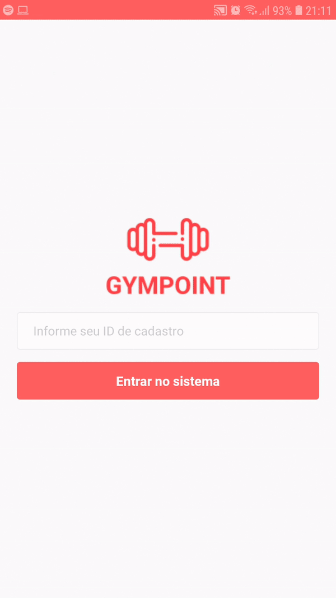

# Gympoint

## Desafio Final Rocketseat GoStack React Native



## Equipamento Utilizado

1. Ubuntu 18.04 LTS
2. Celular Android 8.0

## Getting Started

É pré-requisito configurar o [Backend da Aplicação](https://github.com/eduqg/GympointBack) para a execução deste projeto.

Clone este repositório e na pasta raiz instale as dependências do projeto.

```console
yarn
```

Caso queira configurar o desenvolvimento via wifi, consulte o arquivo de [Configuração via Wifi](WifiPhoneConfiguration.md) (Recomendado).


Configure o arquivo .env com seu ip ou com localhost.

```console
cp .env-example .env
```

Execute o metro bundler.

```console
yarn start
```

Em um outro terminal, instale o aplicativo.

```console
react-native run-android
```

## Testes

Execute os testes da aplicação. A primeira execução pode demorar.

```console
yarn test
```


## Características do software

### Funcionalidades

* Entrar como estudante.
* Sair.
* Pedir auxílio.
* Listar pedidos de auxílio feitos.
* Fazer Checkin.
* Listar Checkins.
* Navegação com header.
* Toasts de feedback.

### Tecnologias principais

* Redux.
* Redux-saga.
* Redux persist.
* Somente Functional Components.
* Utilização de React Hooks.
* Axios.
* Integrado ao backend Gympoint em Node.js.
* Prettier, EditorConfig e Prettier para estilizações de código.
* Utilização de date-fns.
<!--
## Imagens do Aplicativo

Entrar


Pedidos de auxílio


Checkin


-->
